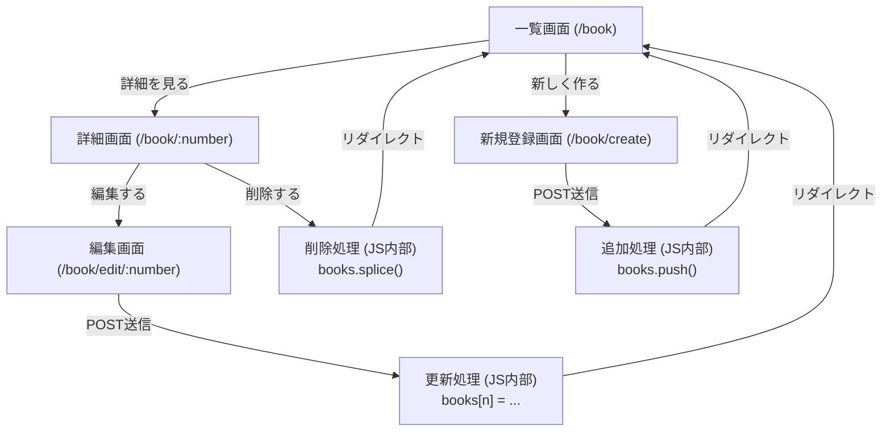

```mermaid
    graph TD
    List["一覧画面 (/book)"] -- "詳細を見る" --> Detail["詳細画面 (/book/:number)"]
    List -- "新しく作る" --> New["新規登録画面 (/book/create)"]
    
    Detail -- "編集する" --> Edit["編集画面 (/book/edit/:number)"]
    Detail -- "削除する" --> DeleteProcess["削除処理 (JS内部)<br>books.splice()"]
    
    New -- "POST送信" --> CreateProcess["追加処理 (JS内部)<br>books.push()"]
    Edit -- "POST送信" --> UpdateProcess["更新処理 (JS内部)<br>books[n] = ..."]
    
    CreateProcess -- "リダイレクト" --> List
    UpdateProcess -- "リダイレクト" --> List
    DeleteProcess -- "リダイレクト" --> List
    

```