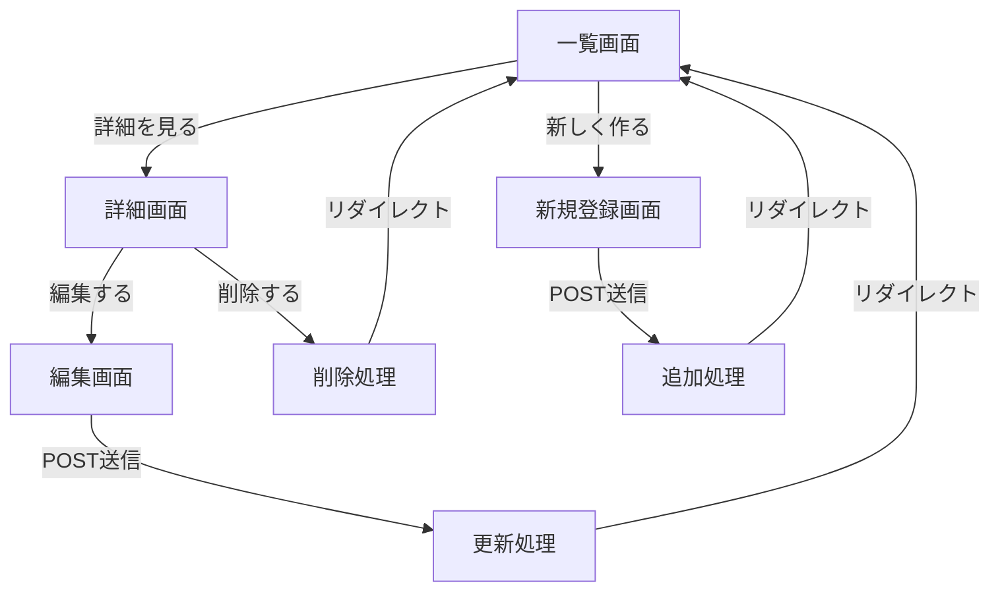

```mermaid
    graph TD
    List["一覧画面"] -- "詳細を見る" --> Detail["詳細画面"]
    List -- "新しく作る" --> New["新規登録画面"]
    
    Detail -- "編集する" --> Edit["編集画面"]
    Detail -- "削除する" --> DeleteProcess["削除処理"]
    
    New -- "POST送信" --> CreateProcess["追加処理"]
    Edit -- "POST送信" --> UpdateProcess["更新処理"]
    
    CreateProcess -- "リダイレクト" --> List
    UpdateProcess -- "リダイレクト" --> List
    DeleteProcess -- "リダイレクト" --> List
    

```